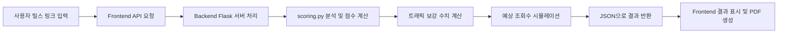

# 🧾 Reels Analyzer 소개 자료 & 발표 초안

---

## 🎯 프로젝트 개요

**Reels Analyzer**는 인스타그램 릴스 콘텐츠의 실제 성과를 정량 분석하고, AI 기반 트래픽 전략을 추천하는 웹 기반 분석 도구입니다.

- 마케팅 성과를 **알고리즘 점수화**
- 인스타그램 노출 알고리즘 기반 **트래픽 보강 추천**
- 예상 도달률 **시뮬레이션** 및 PDF **보고서 출력** 가능
- 누구나 쉽게 사용할 수 있는 **직관적 웹 인터페이스** 제공

---

## 📦 핵심 기능

| 기능 | 설명 |
|------|------|
| 릴스 링크 입력 | 릴스 콘텐츠 URL 기반 분석 시작 |
| 알고리즘 점수 계산 | 좋아요/댓글/저장/공유/시청 시간 기반 10점 정규화 점수 |
| 트래픽 보강 전략 | 부족한 지표를 기준으로 AI 기반 보강 수치 및 이유 제시 |
| 예상 조회수 증가 예측 | 시뮬레이션 방식으로 증가량 예측 |
| PDF 리포트 출력 | 결과 요약 및 제안을 포함한 보고서 다운로드 |
| 프론트 UI | 반응형 UI + 애니메이션으로 사용성 향상 |

---

## 🔧 작동 원리 및 기술 스택

### 👨‍💻 사용 기술 스택

| 분류 | 스택 |
|------|------|
| 프론트엔드 | React.js, TailwindCSS, Framer Motion, jsPDF |
| 백엔드 | Flask (Python), Flask-CORS, REST API |
| 문서 생성 | jsPDF, AutoTable |
| 예측 모델 (예정) | Scikit-learn 또는 PyTorch 기반 ML 모델 |

### ⚙ 작동 흐름

---

## 🗣 발표 포인트

1. **기획 동기**: 릴스는 도달률이 중요하지만, 객관적인 분석 도구가 없다.
2. **차별점**:
   - 인스타그램 알고리즘 구조를 수치화하여 누구나 해석 가능
   - 단순 수집이 아닌 예측과 전략 제안까지 포함
   - 클릭 한 번으로 리포트 생성 및 외부 공유
3. **고객 가치 제안**:
   - 광고주: 예산 낭비 없이 효율적 투자 가능
   - 콘텐츠 제작자: 개선 포인트를 명확하게 파악 가능
   - 마케팅 대행사: 제안서 작성 및 보고서 자동화 도구로 활용 가능
4. **AI 확장성**:
   - 유사 릴스 클러스터링 기반 추천 알고리즘
   - 예산/성과 최적화 자동 시뮬레이션 기능 개발 예정

---

## 📤 배포 및 운영 (예정)

- Front: Vercel / Netlify
- Back: Render / Railway (Flask + CORS)
- GitHub 저장소 압축본 제공됨 (`reels-analyzer.zip`)
- Docker 이미지 / CI-CD 구성 예정

---

## 🙋 대상자 & 고객

- 광고주 및 브랜드 마케터
- 인플루언서 에이전시
- SNS 마케팅 대행사
- 콘텐츠 제작자 / 쇼츠 유튜버

---

> 이 프로젝트는 콘텐츠 퍼포먼스를 "숫자로 이해하고, 전략으로 바꾸는" 도구입니다. 
> **누구나 릴스를 해석하고, 성공 전략을 만들 수 있도록 돕습니다.**
